# 01_FirstExample

In this first CODESYS example, we are going to create a project, connect to a PLC on the network, download the program to it, and run it.

## REQUIREMENTS:
A PLC5000 with its IP address in the same range as the PC. In this example, the PLC will be configured with the IP address **192.168.1.59**.

---

## STEPS:

### 1. Start Codesys
Launch the CODESYS software on your PC.

### 2. Create a new project
Select the option to start a new project.
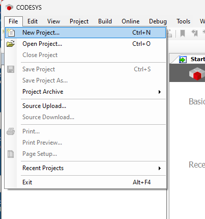

### 3. Select the project type
Choose the "Standard project" type and assign a name to it.
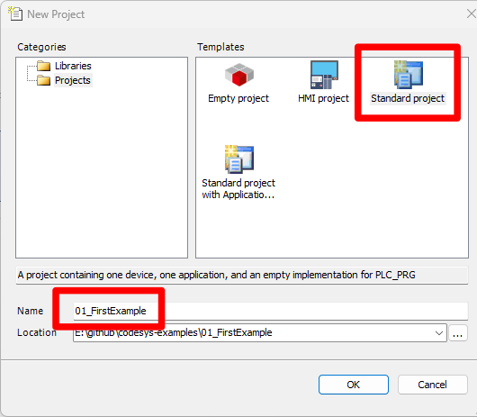

### 4. Select the device and language
Select the device "Montelec-Cortex-Linux" and set the base program language to Ladder Diagram (LD).
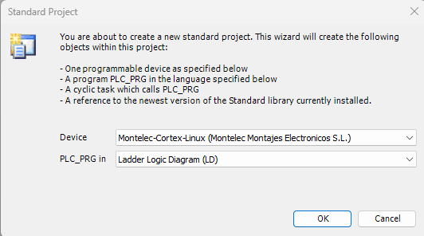

### 5. Scan the network
Once the project is created, we will scan the network to locate the PLCs. Double-click on "Device".
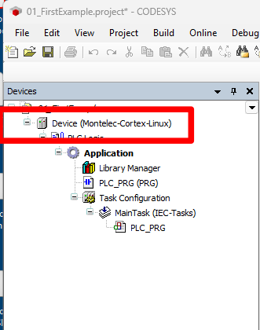

### 6. Scan Network button
In the "Device" window, click on the "Scan Network" button.
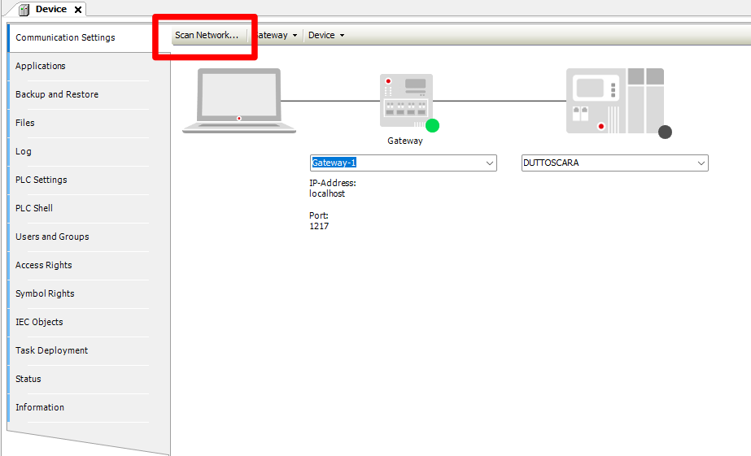

### 7. Select the PLC
All PLCs available on the network will appear. In our case, select "PLC59".
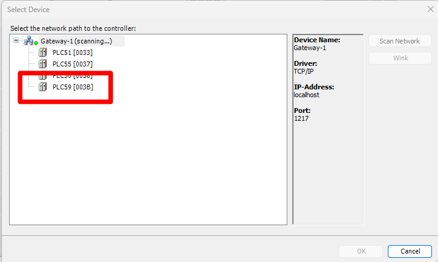

### 8. Open the main program
We are going to create the base program. Double-click on "PLC_PRG".

### 9. Add a block
In the Ladder editor, drag a "Box with EN" from the ToolBox into the first rung.
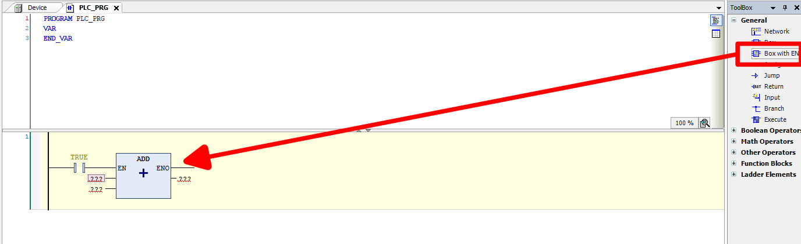

### 10. Create the variable
Double-click on the block's input and create the variable named `counter`.
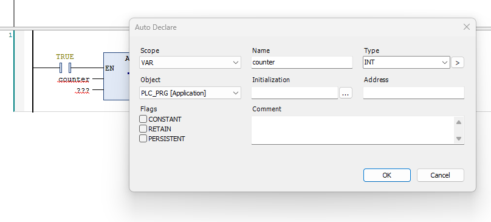

### 11. Configure the ADD block
Place a `1` at the other input, and assign the `counter` variable to the output again. Change the block type to `ADD` and set the contact before the block to `TRUE`.
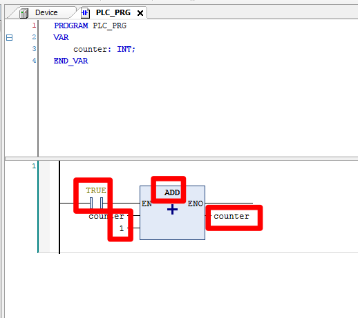

### 12. Download to PLC
Download/send the program to the PLC.
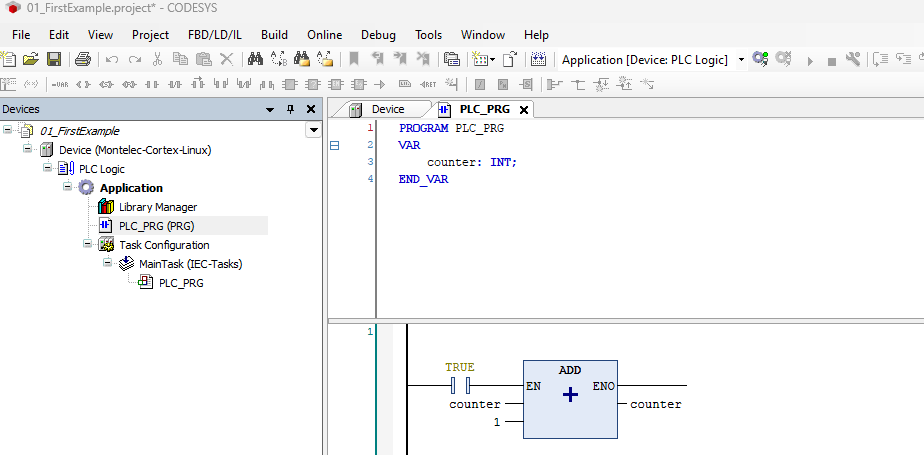

### 13. Run the project
Once the project is downloaded, switch the PLC to RUN mode.
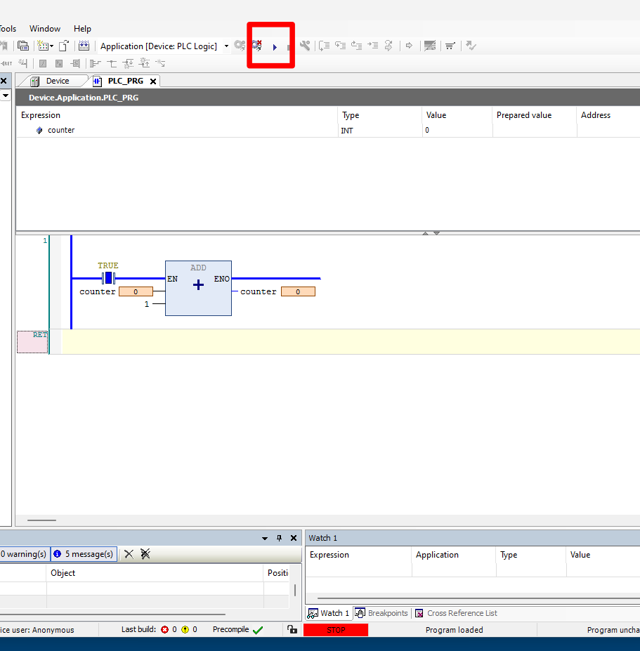

### 14. Verify execution
Once the PLC is in RUN mode, "RUN" will be displayed on the screen, and you will see the `counter` variable incrementing.
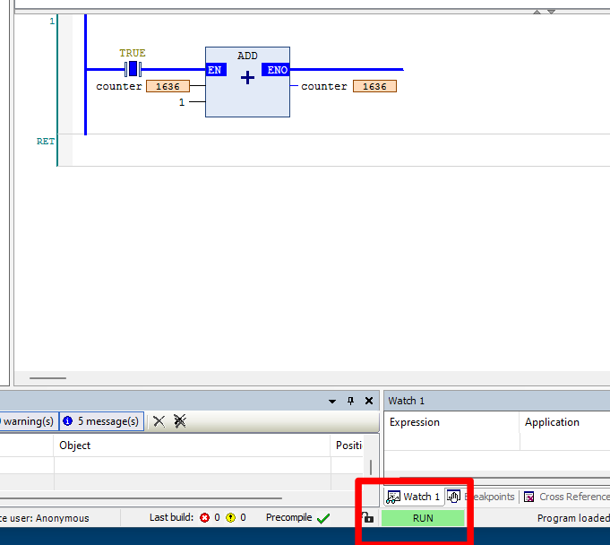

---

> 💡 **Note:** If the program does not enter RUN mode, check that the physical switch on the front panel of the PLC is set to RUN.