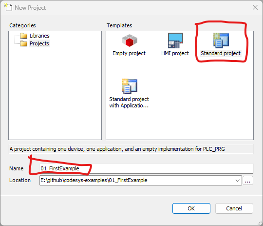

# 01_FirstExample

Initial example project for PLC programming using CODESYS. This repository serves as a starting point for developing automation logic and managing industrial control configurations.

## System Requirements

* **Software:** CODESYS V3.5 (Specify your exact version here, e.g., SP19 or SP20).
* **Target Device:** (e.g., CODESYS Control Win V3, Raspberry Pi, or specific PLC model).
* **Additional Libraries:** (List any external or non-standard libraries used in this project).

## Repository Structure

* `01_FirstExample.project`: Main CODESYS project file.
* `/images`: Screenshots, architectural diagrams, and project documentation images.

## Screenshots

Below is a general overview of the project setup within the CODESYS environment:

